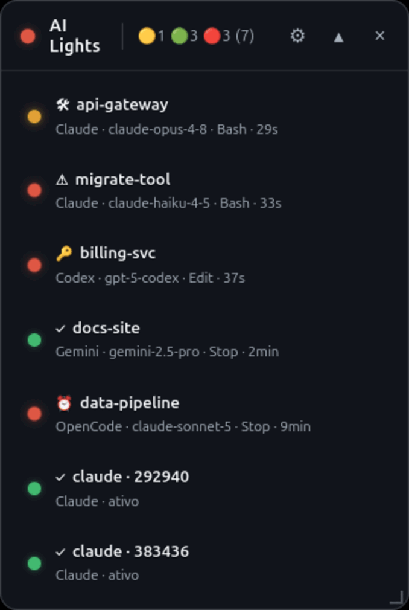
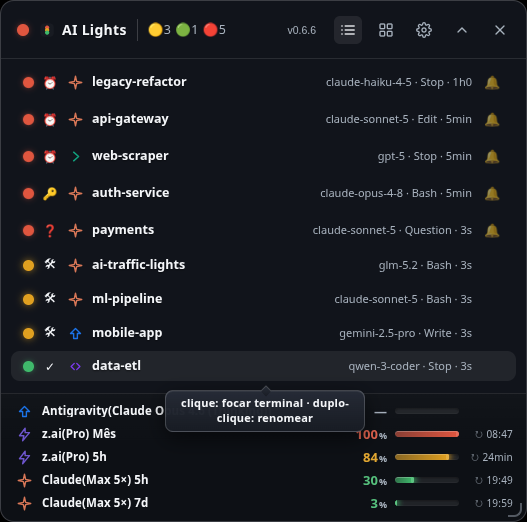
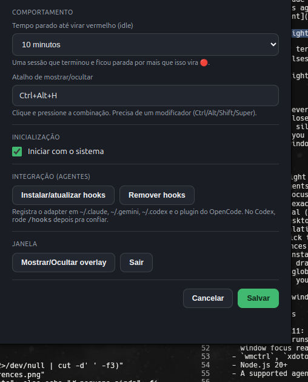

# 🚦 AI Traffic Lights

[English](README.md) | **Português (Brasil)**

[](https://github.com/aronpc/ai-traffic-lights/actions/workflows/ci.yml)

Overlay translúcido sempre no topo (Electron) que mostra o estado de cada
sessão de **agente de IA em terminal** no seu desktop como um semáforo:
🟢 pronto · 🟡 trabalhando · 🔴 precisa de você.

Monitora **Claude Code**, **Antigravity**, **Codex** e **OpenCode** hoje. A
arquitetura é agnóstica — agentes novos entram via adapters (ver
[Adicionando um agente](#adicionando-um-novo-agente)).

<p align="center"></p>

_Uma luz por sessão de agente em terminal: 🟢 pronto · 🟡 trabalhando · 🔴
precisa de você. Animação: o LED vermelho pulsa. Print estático abaixo._

<p align="center"></p>

## Por quê

Rodando várias sessões de agentes em paralelo — terminais, abas, projetos —
você perde o fio: qual terminou, qual ainda processa, qual está há dez minutos
esperando uma aprovação em silêncio. O overlay resolve num relance: uma luz
por sessão, clique para pular pro terminal — **janela _e_ aba**.

## Funcionalidades

- 🟢🟡🔴 Uma luz por sessão + luz agregada no cabeçalho
- 🤖 **Quatro agentes, um overlay**: Claude Code, Antigravity, Codex e OpenCode
- 🌐 Interface em inglês e português — segue o idioma do sistema, com troca
  nas Preferências
- **Click-to-focus**: pula pro terminal da sessão — a janela exata e, no Warp,
  a **aba** exata (via `warp://session/<uuid>`); no Tilix, o terminal exato
  (via D-Bus `TILIX_ID`)
- 🔔 Beep + notificação nativa quando uma sessão fica vermelha (rate-limited)
- ⏰ Escalada de idle: sessão pronta e esquecida vira vermelha (configurável)
- 🔔 **Snooze de alerta** por sessão (silencia o apito por 1h numa sessão vermelha)
- 🔝 Sessões **ordenadas por urgência** (vermelho → amarelo → verde); **ícone do
  tray dinâmico** pinta com a pior cor e mostra a contagem no hover
- 🚀 **Quick Launcher**: inicia um agente (+ Claude / + Antigravity / + Codex / +
  OpenCode) pelo empty state do overlay ou pelo tray — abre o terminal no
  último projeto e a sessão acende sozinha
- ✏️ Duplo-clique renomeia a sessão (apelidos persistem por projeto)
- 👁 **Marcar terminal vermelho como lido**: clicar numa sessão 🔴 foca o
  terminal *e* a deixa cinza até chegar uma nova notificação (opção nas Preferências)
- 📊 **Medidores de uso por agente** (rodapé): uma linha alinhada por janela de
  uso, com barra de % e próximo reset — **Claude** (5h + semanal, números reais
  da API OAuth de uso), **Codex** (5h + semanal, lidos passivamente do rollout
  da sessão) e **GLM Coding Plan** (tokens 5h + MCP mensal). Linhas ficam âmbar
  ≥70%, vermelhas ≥90%; o último valor persiste (fica cinza quando velho) e
  sobrevive a reinícios. Alterne entre os medidores e o Quick Launcher no cabeçalho
- 🎚️ **Aparência**: slider de transparência da janela + modo de lista compacta
  (uma linha densa por sessão), ambos ao vivo e lembrados
- ⚙️ **Janela de Preferências** (ícone de engrenagem): threshold de idle,
  atalho global, autostart, instalar/remover hooks, aparência, mostrar/ocultar,
  sair — com a versão do app e um link do repo no rodapé
- Altura automática, arrasta por qualquer lugar, largura ajustável, posição + estado da UI persistidos
- 🔄 **Versão + checagem de atualização** no cabeçalho — mostra a versão instalada
  e, quando há release mais nova no GitHub, um selo de um clique pra abri-la
- Ícone no tray + atalho global **`Ctrl+Alt+H`** (configurável)
- Sai do caminho: fora da barra de janelas/alt-tab, nunca maximiza, sem scrollbar

<p align="center"></p>

## Requisitos

- **Linux** (suporte completo no X11, parcial no Wayland — veja [Solução de problemas](#solucao-de-problemas)) ou **macOS** (suporta Apple Silicon M1–M5).
- No Linux: `wmctrl`, `xdotool`, `jq` — `sudo apt install wmctrl xdotool jq`
- No macOS: Homebrew e `jq` — `brew install jq`
- Node.js 20+
- Um agente suportado: [Claude Code](https://claude.com/claude-code),
  [Antigravity CLI](https://antigravity.google/docs/cli/reference),
  [Codex](https://github.com/openai/codex) ou [OpenCode](https://opencode.ai)

## Instalação

Escolha a que preferir para a sua plataforma. **Todas as opções exigem os hooks dos agentes** para o overlay enxergar as sessões do Claude Code / Antigravity / OpenCode — pelo fonte você roda `npm run setup-hook`; num build empacotado você clica em **Instalar/atualizar hooks** no menu do tray ou na janela de Preferências (ou no botão de onboarding do overlay).

### macOS (M1 a M5 / arm64)

#### Opção 1: Script automatizado (recomendado)
Rode o comando de linha única abaixo no terminal. Ele irá verificar dependências (instalando o `jq` via Homebrew se necessário), baixar a versão `.dmg` mais recente, copiar o `AI Traffic Lights.app` para `/Applications` e configurar aliases de terminal (`atl` e `ai-traffic-lights`) no seu `~/.zshrc` e `~/.bash_profile`:

```bash
curl -fsSL https://raw.githubusercontent.com/aronpc/ai-traffic-lights/main/install_macos.sh | bash
```

Para iniciar o aplicativo via terminal, abra uma nova aba do terminal (ou execute `source ~/.zshrc`) e execute:
```bash
atl
```

#### Opção 2: Instalação Manual
1. Baixe o arquivo `.dmg` da [última release](https://github.com/aronpc/ai-traffic-lights/releases/latest).
2. Abra o arquivo `.dmg` e arraste o `AI Traffic Lights.app` para a sua pasta `/Applications`.

---

### Linux

#### Opção 1: AppImage (recomendado, auto-atualizável)
Um comando único que baixa a versão mais recente, torna-a executável, instala o ícone no tema do sistema e cria o atalho no menu de aplicativos:

```bash
curl -fsSL https://raw.githubusercontent.com/aronpc/ai-traffic-lights/main/install.sh | bash
```

Depois abra pelo menu de aplicativos ou execute `~/Applications/AI-Traffic-Lights.AppImage`. Para desinstalar:
```bash
curl -fsSL https://raw.githubusercontent.com/aronpc/ai-traffic-lights/main/install.sh | bash -s -- --uninstall
```

<details><summary>Instalação manual do AppImage</summary>

Baixe o `.AppImage` da [última release](https://github.com/aronpc/ai-traffic-lights/releases/latest), coloque em uma pasta com permissão de escrita para o usuário (o auto-atualizador reescreve esse arquivo no lugar — não use `/opt` ou `/usr`) e rode:
```bash
chmod +x AI-Traffic-Lights-*.AppImage
./AI-Traffic-Lights-*.AppImage
```
</details>

#### Opção 2: Pacote Debian (.deb)
Baixe o `.deb` da [última release](https://github.com/aronpc/ai-traffic-lights/releases/latest) e instale:

```bash
sudo dpkg -i ai-traffic-lights_*.deb
```

---

### Pelo fonte (Desenvolvimento - Linux & macOS)
```bash
git clone https://github.com/aronpc/ai-traffic-lights.git
cd ai-traffic-lights
npm install
npm run setup-hook   # registra os adapters: Claude Code (~/.claude),
                     # Antigravity CLI (~/.gemini/antigravity-cli) e OpenCode (plugin em
                     # ~/.config/opencode/plugin/), conforme presentes
npm start            # abre o overlay
```

O `setup-hook` é idempotente e cirúrgico: faz backup do `settings.json` e nunca toca hooks de outras ferramentas. O comando registrado aponta para uma **cópia estável** auto-atualizada do hook em `~/.local/share/ai-traffic-lights/bin/` — mover o projeto (ou rodar o AppImage/App, cujo ponto de montagem muda a cada execução) nunca quebra nada. `npm run remove-hook` desfaz tudo com o mesmo cuidado. O menu do tray e a janela de Preferências oferecem as mesmas ações de instalar/remover para instalações empacotadas.

Sessões novas do Claude Code aparecem imediatamente; sessões já abertas aparecem no próximo evento delas.

## Como funciona

```
Sessão Claude Code ──hooks──▶ traffic-hook.sh (adapter, <25ms, fork-free)
                                     │ escreve
                                     ▼
                   ~/.local/share/ai-traffic-lights/state/<sessão>.json
                                     │ observado (chokidar)
                                     ▼
                   Electron main ──IPC──▶ renderer: computeState() → 🟢🟡🔴
```

> **Decisão de arquitetura:** o adapter só registra eventos. O **estado (cor)
> é computado no renderer**, porque a escalada de idle (verde→vermelho após
> N min) exige relógio — coisa que um hook event-driven não tem.

> **O contrato de integração é o state file, não o código.** Qualquer coisa
> que escreva um JSON válido no diretório de estado vira uma luz no overlay.

> Veja [docs/ARCHITECTURE.md](docs/ARCHITECTURE.md) para diagramas de integração
> e um guia passo-a-passo de como adicionar um agente. _(em inglês)_

### Contrato do state file (schema_version 2)

**Local:** `${XDG_DATA_HOME:-~/.local/share}/ai-traffic-lights/state/<session_id>.json`

```jsonc
{
  "schema_version": 2,           // bump ao mudar o schema
  "agent": "claude",             // id do agente (chave em src/agents.js)
  "session_id": "abc-123",       // chave, = nome do arquivo
  "pid": 986893,                 // PID do processo do agente (sweep de mortos)
  "cwd": "/home/user/projeto",   // diretório do projeto (basename = label padrão)
  "term_program": "WarpTerminal",// terminal de origem (null se desconhecido)
  "windowid": "67108868",        // janela X11 da sessão — ver abaixo
  "focus_url": "warp://session/8726…", // Warp: URI de foco (xdg-open)
  "tilix_id": null,              // Tilix: id do terminal p/ activate-terminal (D-Bus)
  "zellij_session": null,        // nome da sessão zellij, se dentro do zellij
  "last_event": "Stop",          // último hook_event_name
  "last_event_ts": 1783124001,   // epoch do último evento (UTC)
  "last_tool": "Bash",           // último tool_name (null em evento sem tool)
  "notification_type": null,     // discriminador do Notification (ver abaixo) — null salvo se last_event for Notification
  "events": [                    // log rolante (últimos 50), append-only
    { "ts": 1783124000, "event": "PostToolUse", "tool": "Bash" },
    { "ts": 1783124001, "event": "Stop",        "tool": null }
  ]
}
```

**Tipos:** todo `*_ts` é epoch inteiro. `windowid` é **string** (decimal do
xdotool ou hex `0x…`; o app normaliza). `pid` é inteiro.

### Focando a janela certa — e a aba certa

**Janela** (`windowid`): capturado no `UserPromptSubmit`/`SessionStart` (a
janela focada nesse instante **é** o terminal da sessão) via `xdotool
getactivewindow`, preservado entre eventos. Antes de usar, o `focusSession()`
**valida** o id contra a árvore de processos da sessão — um id obsoleto ou
reciclado, cuja janela não pertence mais à sessão, é descartado (um clique
nunca foca a janela errada); o fallback é a 1ª janela do processo da sessão.

**Aba** (invisível pro X11 — só o terminal a seleciona):

| Terminal | Canal | Env var capturada |
|---|---|---|
| Warp | `xdg-open warp://session/<uuid>` | `WARP_FOCUS_URL` |
| Tilix | `gdbus … org.gtk.Actions.Activate activate-terminal <id>` | `TILIX_ID` |

A lógica de decisão (`pickWindow`/`tabChannel`) é um módulo puro,
[`src/focus.js`](src/focus.js) — o `main.js` só faz o I/O. No X11 a janela sobe
e então a aba é selecionada; no Wayland o canal de aba vai primeiro (wmctrl só
enxerga XWayland).

### Mapeamento evento → estado (computeState, renderer)

| Evento do adapter | level | reason (sub-ícone) |
|---|---|---|
| `SessionStart` | done 🟢 | ✓ (inicial) |
| `UserPromptSubmit`, `PreToolUse`, `PostToolUse` | processing 🟡 | 🛠 |
| `Stop` | done 🟢 (→ awaiting 🔴⏰ se idle > 5 min) | ✓ / ⏰ |
| `PermissionRequest` | awaiting 🔴 | 🔑 |
| `Notification` | depende do `notification_type`: `permission_prompt` / `idle_prompt` / `elicitation_dialog` → awaiting 🔴❓; `auth_success` / `elicitation_complete` / `elicitation_response` → done 🟢✓ | ❓ / ✓ |
| `PostToolUseFailure` | awaiting 🔴 | ⚠️ |

## Adicionando um novo agente

Dois passos — o app se adapta ao que você declarar:

1. **Registre-o** em [`src/agents.js`](src/agents.js): uma linha com `label`
   (UI) e `comm` (nomes de processo em `/proc/<pid>/comm`, para detectar
   sessões vivas que ainda não têm state file).
2. **Escreva um adapter**: qualquer coisa que grave state files seguindo o
   contrato acima. O [`hooks/traffic-hook.sh`](hooks/traffic-hook.sh) é a
   implementação de referência — e já serve **dois** agentes: para o Antigravity
   CLI ele roda com `AI_TL_AGENT=antigravity` e usa o vocabulário canônico diretamente —
   o renderer nunca aprende dialetos por agente.

Para CLIs Node cujo `comm` de processo é só `node` (Antigravity), a sonda `/proc`
identifica sessões pelo basename do script no argv — declarado via campo
`argv` no registro.

Detalhes em [CONTRIBUTING.md](CONTRIBUTING.md).

## Solução de problemas

- **Overlay mostra "nenhuma sessão ativa"** — rodou `npm run setup-hook`?
  Sessões já abertas só aparecem no próximo evento (mande qualquer prompt).
- **Clique não foca / foca a janela errada** — no Linux, certifique-se de que `wmctrl` e `xdotool` estão instalados. No macOS, o click-to-focus utiliza AppleScript (`osascript`) para focar a janela. Se falhar, certifique-se de que o `AI Traffic Lights.app` (ou o seu terminal, caso execute pelo fonte) possui permissões de **Acessibilidade** concedidas em *Ajustes do Sistema > Privacidade e Segurança > Acessibilidade*.
- **Wayland** — o overlay em si roda bem (XWayland). Janelas Wayland nativas
  não podem ser focadas por terceiros, então o click-to-focus depende da URI
  de foco do terminal (Warp hoje); o atalho global pode não disparar com um
  app Wayland nativo em foco. Alternativas: clique no ícone do tray, ou
  vincule um atalho customizado do GNOME ao comando do app — **relançar
  alterna mostrar/ocultar** (instância única).
- **Onde ficam meus dados?** — `${XDG_DATA_HOME:-~/.local/share}/ai-traffic-lights/`
  (state files, posição da janela, apelidos). Pode apagar; regenera sozinho.
- **Debug do renderer** — `ATL_DEBUG=1 npm start` loga em `/tmp/atl-renderer.log`.

## Desenvolvimento

```bash
npm install
npm start
```

Testar o adapter isolado:

```bash
echo '{"session_id":"t","hook_event_name":"Stop","cwd":"/tmp"}' | bash hooks/traffic-hook.sh
cat "${XDG_DATA_HOME:-$HOME/.local/share}/ai-traffic-lights/state/t.json" | jq .
```

## Roadmap

- [x] Adapter do Antigravity CLI (hooks) + detecção de idle via sonda argv
- [x] Adapter do OpenCode (plugin: eventos chat/tool/idle/permission, captura
  de modelo — ver `adapters/opencode/`)
- [x] Adapter do Codex (mesmo schema de hooks do Claude; model do payload) —
  atenção: após `setup-hook`, rode `/hooks` no CLI do Codex uma vez pra confiar
- [x] Empacotamento: AppImage + .deb (electron-builder) — ver [Releases](https://github.com/aronpc/ai-traffic-lights/releases)
- [x] Suíte de testes (`node:test`) + CI
- [x] Click-to-focus confiável: validação do window-id + aba exata no Warp
  (`focus_url`) e Tilix (`TILIX_ID` via D-Bus)
- [ ] Foco de aba para terminais sem canal nativo (GNOME Terminal, zellij/tmux)
- [ ] Foco de janela Wayland nativo completo (hoje: XWayland + URI de foco do
  Warp + relançar-para-alternar)
- [x] Threshold de idle e atalho configuráveis (tray → Preferências — guardado
  em `~/.local/share/ai-traffic-lights/settings.json`)

## Licença

[MIT](LICENSE)
