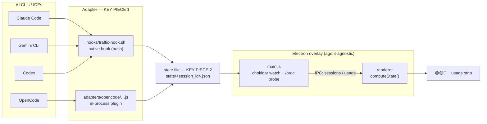
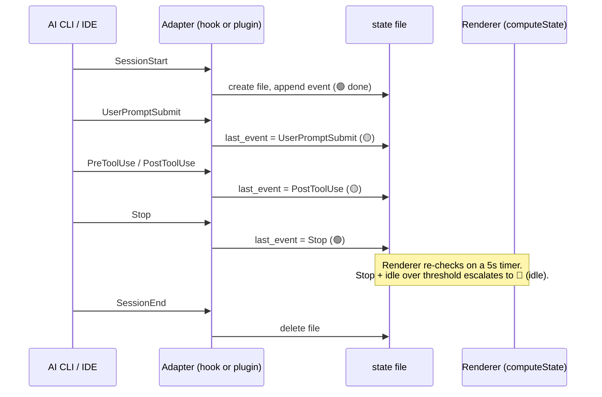
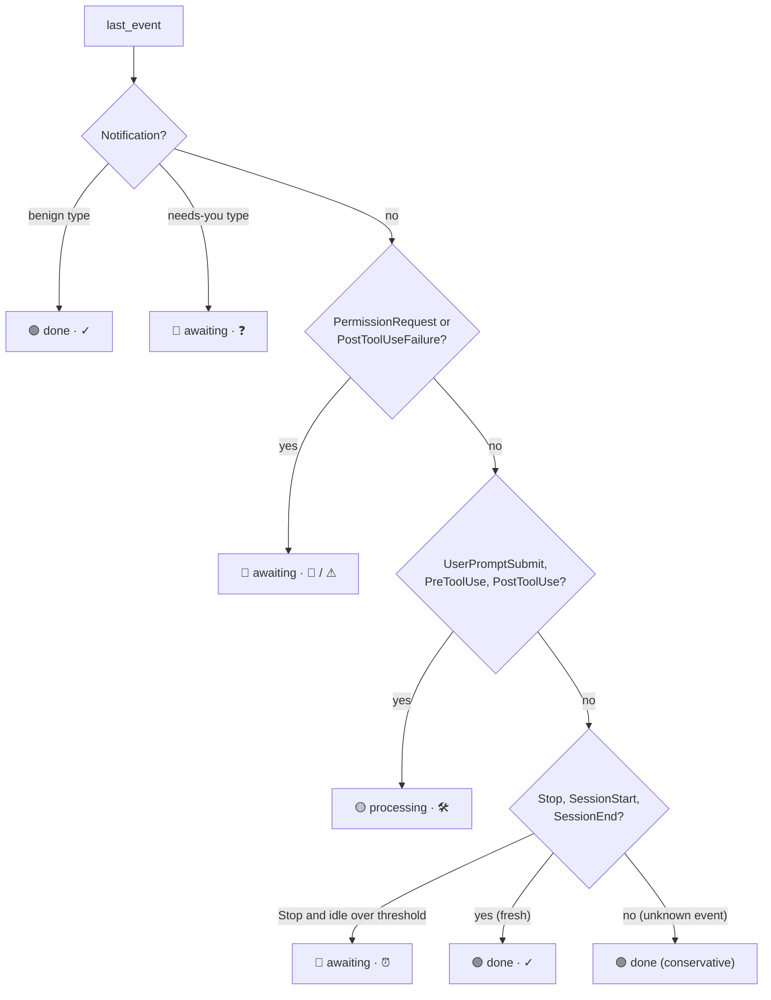
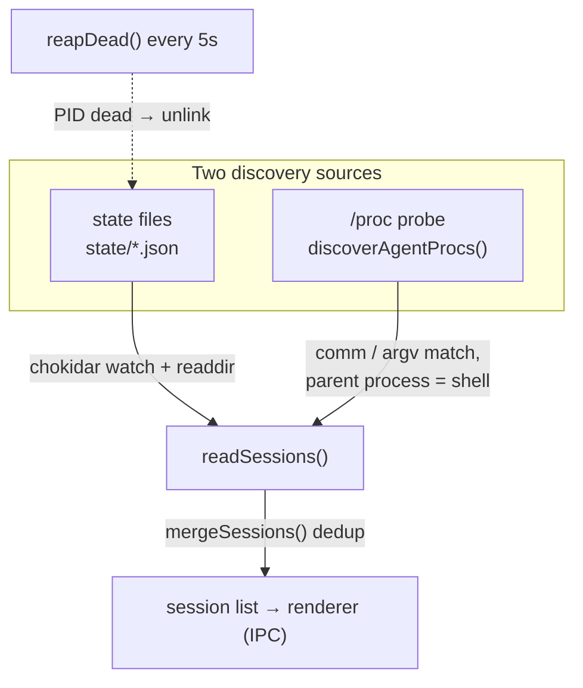

# Architecture

AI Traffic Lights is a translucent, always-on-top Electron overlay that renders
one traffic light (🟢 done · 🟡 working · 🔴 needs you) per **terminal AI agent
session** — Claude Code, Gemini CLI, Codex and OpenCode today. Agents never talk
to the overlay directly. Each agent's *adapter* writes a small JSON **state
file** per session into a shared directory; the overlay watches that directory,
merges in live sessions it finds by probing `/proc`, and the renderer turns each
state file into a colored light plus an optional usage pill.

> **The integration contract is the state file, not the code.** Anything that
> writes a valid `<session_id>.json` into the state directory becomes a light in
> the overlay — no changes to the Electron app are required. The two pieces that
> matter for a new integration are the **adapter** (event translator/writer) and
> the **state file** (the schema below).

**State directory:**
`${XDG_DATA_HOME:-~/.local/share}/ai-traffic-lights/state/<session_id>.json`
(`schema_version: 2`).

---

## 1. Integration flow

The adapter and the state file are the two key pieces — everything to the left
of the state file is per-agent; everything to the right is agent-agnostic.



- **Adapters** translate each agent's native events into a shared vocabulary and
  write the state file. Two shapes exist: a native **hook**
  (`hooks/traffic-hook.sh`, one bash script that already serves Claude Code,
  Gemini and Codex) and an **in-process plugin**
  (`adapters/opencode/ai-traffic-lights.js`, JS running inside OpenCode).
- **`main.js`** watches the state directory with `chokidar` and also probes
  `/proc` for live agent processes that have no state file yet (`readSessions()`
  merges both, deduped by `src/sessions.js`), then pushes the list to the
  renderer over IPC (`sendSessions`).
- **The renderer** computes the color per session with `computeState()`
  (`src/state-machine.js`) and paints the lights, sorted by urgency.

---

## 2. Anatomy of the state file (`schema_version: 2`)

A real file (trimmed):

```jsonc
{
  "schema_version": 2,
  "agent": "claude",
  "session_id": "0872cb83-a68a-4449-8e61-f9b037099c60",
  "pid": 2749781,
  "cwd": "/home/user/project",
  "transcript_path": "/home/user/.claude/projects/…/<session_id>.jsonl",
  "model": "claude-opus-4-8",
  "term_program": "WarpTerminal",
  "windowid": "58720263",
  "focus_url": "warp://session/f20da655c0c144a19e05fa176c36993d",
  "tilix_id": null,
  "zellij_session": null,
  "last_event": "Stop",
  "last_event_ts": 1783436758,
  "last_tool": null,
  "notification_type": null,
  "events": [
    { "ts": 1783436728, "event": "PreToolUse",  "tool": "Bash" },
    { "ts": 1783436729, "event": "PostToolUse", "tool": "Bash" },
    { "ts": 1783436758, "event": "Stop",        "tool": null }
  ]
}
```

| Field | Type | Required | Purpose |
|---|---|---|---|
| `schema_version` | int | Core | Schema version (currently `2`). Bump when the shape changes. |
| `agent` | string | Core | Agent id — a key in [`src/agents.js`](../src/agents.js). Picks label, color and icon. Missing → defaults to `claude` (v1 files). |
| `session_id` | string | **Yes** | Unique session key; **equals the file name**. Only field strictly required for a session to appear (`readSessions` drops entries without it). Adapters must validate it against `^[A-Za-z0-9._-]+$` (anti path-traversal). |
| `pid` | int | Core | Agent process PID. Used to sweep dead sessions (`reapDead` calls `process.kill(pid,0)`) and to read live `/proc/<pid>/environ` for GLM creds / Codex cwd. Missing → the session is never reaped. |
| `cwd` | string \| null | Optional | Project directory. Its basename is the default session label. |
| `transcript_path` | string \| null | Optional | Path to the agent's transcript (`.jsonl`). Used to backfill `model`. |
| `model` | string \| null | Optional | Model name (e.g. `gpt-5.5`, `glm-5.2`). Drives the usage strip and per-line label. |
| `term_program` | string \| null | Optional | Source terminal (`$TERM_PROGRAM`), e.g. `WarpTerminal`. |
| `windowid` | string \| null | Optional | X11 window id (decimal or `0x…` hex; app normalizes) for click-to-focus. |
| `focus_url` | string \| null | Optional | Warp tab focus URI (`warp://session/<uuid>`), opened via `xdg-open`. |
| `tilix_id` | string \| null | Optional | Tilix terminal id for exact-tab focus via D-Bus `activate-terminal`. |
| `zellij_session` | string \| null | Optional | zellij session name when running inside zellij. |
| `last_event` | string | Core | Last canonical event — **this is what `computeState` maps to a color**. |
| `last_event_ts` | int (epoch s) | Core | Epoch seconds of the last event. Feeds the idle-escalation clock. |
| `last_tool` | string \| null | Optional | Last `tool_name` (null for tool-less events). |
| `notification_type` | string \| null | Optional | Discriminator for `Notification` events (see §4). Null unless `last_event == "Notification"`. |
| `events` | array | Optional | Rolling, **append-only** log of the last 50 `{ ts, event, tool }`. |

**Required?** column: **Yes** = mandatory for the session to render; **Core** =
drives the color / lifecycle and should always be written; **Optional** =
enriches features (focus, labels, usage) and may be `null`.

---

## 3. State-file lifecycle

The adapter **only records events** (append-only). It never writes a color. The
color is computed later, in the renderer, because idle escalation
(green → red after N minutes) needs a *clock*, and an event-driven hook has none.



Notes:

- **Writes are atomic:** the adapter writes `<file>.tmp` then `rename`s it over
  the target, so the overlay never reads a half-written file. Orphan `.tmp`
  files older than 60s are swept by `reapDead`.
- **Merge-preserve:** `windowid` / `focus_url` / `tilix_id` are captured at
  prompt time and carried forward — a later event without them reuses the
  existing value instead of regressing to `null`.
- **Crash safety:** if a session dies without `SessionEnd`, `reapDead` removes
  the file once its `pid` is gone. A corrupt/partial file is tolerated (parsers
  fall back to `{}`) and the session regenerates it on its next event.

---

## 4. Event → color (`computeState`, in the renderer)

`computeState(state, nowSec, cfg, readAt)` in [`src/state-machine.js`](../src/state-machine.js)
maps `last_event` to `{ level, reason }`, evaluated as an ordered set of guards.
`level` is the color; `reason` is the sub-icon shown next to the name. The
optional `readAt` demotes an `awaiting` (🔴) session whose latest event is at or
before that timestamp to `read` (⚪ grey, "marked read") — see *mark-as-read*
below; a newer red event (`last_event_ts > readAt`) re-lights it.



| `last_event` | `level` | Light · sub-icon |
|---|---|---|
| `SessionStart` | done | 🟢 · ✓ |
| `UserPromptSubmit`, `PreToolUse`, `PostToolUse` | processing | 🟡 · 🛠 |
| `Stop` | done → **awaiting if idle > threshold** (default 5 min, configurable) | 🟢 · ✓ → 🔴 · ⏰ |
| `SessionEnd` | done | 🟢 · ✓ *(file is usually deleted first)* |
| `PermissionRequest` | awaiting | 🔴 · 🔑 |
| `PostToolUseFailure` | awaiting | 🔴 · ⚠ |
| `Notification` (`permission_prompt` / `idle_prompt` / `elicitation_dialog`) | awaiting | 🔴 · ❓ |
| `Notification` (`auth_success` / `elicitation_complete` / `elicitation_response`) | done | 🟢 · ✓ |
| *anything else* | done (conservative) | 🟢 |

`Notification` is classified strictly by `notification_type` — never by the
message string (unstable across versions and subject to i18n).

---

## 5. Guide: add a new agent / IDE

### Step 1 — register the agent in [`src/agents.js`](../src/agents.js)

Add one entry to the `AGENTS` registry (the single source of truth):

```js
myagent: {
  label: 'MyAgent',        // UI label (session row + notifications)
  comm:  ['myagent'],      // process names in /proc/<pid>/comm (live-session probe)
  argv:  ['myagent'],      // OPTIONAL: script basename if comm is just "node"
  bin:   'myagent',        // executable on PATH for the Quick Launcher
  color: '#7C3AED',        // brand color
  mark:  '<path d="…"/>',  // inline 24×24 SVG icon for the launcher
  adapter: 'adapters/myagent/…',  // informational: path to the adapter
},
```

- `comm` lets the `/proc` probe detect a **live** session that has no state file
  yet (idle, or started before the adapter ran).
- If the CLI is a Node script whose `comm` is just `"node"` (like Gemini and
  Codex), leave `comm: []` and set `argv` to the script basename — the probe
  then matches on `/proc/<pid>/cmdline`.

### Step 2 — write an adapter that writes state files

The adapter translates the agent's native events into the **canonical
vocabulary** and writes the state file. Two proven shapes:

| Shape | Reference | When |
|---|---|---|
| Native **hook** (out-of-process) | [`hooks/traffic-hook.sh`](../hooks/traffic-hook.sh) | The agent can run a shell command per event (Claude Code / Gemini / Codex). |
| In-process **plugin** | [`adapters/opencode/ai-traffic-lights.js`](../adapters/opencode/ai-traffic-lights.js) | The agent loads plugins in its own process (OpenCode). |

**Canonical event vocabulary** (translate the agent's dialect into this):

| Canonical event | Claude Code (native) | Gemini CLI | OpenCode |
|---|---|---|---|
| `SessionStart` | `SessionStart` | — | — |
| `UserPromptSubmit` | `UserPromptSubmit` | `BeforeAgent` | `chat.message` / `message.updated`(user) |
| `PreToolUse` | `PreToolUse` | `BeforeTool` | `tool.execute.before` |
| `PostToolUse` | `PostToolUse` | `AfterTool` | `tool.execute.after` |
| `Stop` | `Stop` | `AfterAgent` | `session.idle` |
| `PermissionRequest` | `PermissionRequest` | — | `permission.updated` |
| `PostToolUseFailure` | `PostToolUseFailure` | — | `session.error` |
| `Notification` (+ `notification_type`) | `Notification` | — | — |
| `SessionEnd` (delete the file) | `SessionEnd` | — | `session.deleted` |

The hook serves Claude with `AI_TL_AGENT` unset and Gemini with
`AI_TL_AGENT=gemini` (it rewrites `BeforeAgent`/`BeforeTool`/`AfterTool`/
`AfterAgent` to the canonical names), so the renderer never learns per-agent
dialects. Unknown events pass through and resolve to a conservative green.

**Golden rules of an adapter** (both references follow them):

1. **Fast** — the hook runs on *every* tool call of *every* session (global
   blast radius); its budget is **< 25 ms**. It is nearly fork-free: bash regex
   instead of `jq` to extract ids, a `/proc` walk instead of `ps`,
   `printf '%(%s)T'` instead of `date`. In-process plugins are already cheap.
2. **Never fail** — swallow every exception. The hook always `return 0` / `exit
   0`; the plugin wraps every handler in `try {} catch {}`. Breaking the host
   agent is unacceptable.
3. **Atomic write** — write `<file>.tmp`, then `rename` over the target. Never
   write the final path in place.
4. **Validate `session_id`** — accept only `^[A-Za-z0-9._-]+$` before using it
   as a file name, so a malicious/buggy payload can't escape the state dir with
   `../`.
5. **Preserve, don't regress** — merge focus fields (`windowid`, `focus_url`,
   `tilix_id`) from the existing file when the current event doesn't carry them;
   keep `events` append-only and capped at the last 50.

Test an adapter standalone:

```bash
echo '{"session_id":"t","hook_event_name":"Stop","cwd":"/tmp"}' | bash hooks/traffic-hook.sh
cat "${XDG_DATA_HOME:-$HOME/.local/share}/ai-traffic-lights/state/t.json" | jq .
```

### Step 3 — (optional) usage collector in [`src/usage.js`](../src/usage.js)

If the agent exposes consumption/quota locally, add a `readXxxUsage()` that
returns the canonical usage object (`{ id, agent, title, usedPct, resetAt,
resetInMin, extra, source, error }`) and wire it into `collectUsage()`. Keep
pure parsing separate from I/O so it stays testable, and **never throw** — a
missing credential just omits the agent. Two real examples:

- **Codex — passive, no network:** `readCodexUsage()` reads the newest
  `~/.codex/sessions/**/rollout-*.jsonl` for the session's `cwd`, takes the last
  `token_count` event's `rate_limits` (5h + weekly windows), and yields real %
  and reset times without a request.
- **GLM — active, authenticated:** `readGlmUsage()` calls
  `/api/monitor/usage/quota/limit` with the `ANTHROPIC_AUTH_TOKEN` read live
  from the session's `/proc/<pid>/environ`, caching per token for 30s.

Agents that expose usage only via runtime response headers (Codex-over-API,
Gemini) are omitted rather than guessed.

---

## 6. How the overlay discovers sessions

Two independent sources feed `readSessions()`, which merges and dedups them
(`src/sessions.js`). This is why a session started *before* its adapter was
installed still shows up (as a bare "active" light) until its first event
writes a state file.



- **State files** — `chokidar` watches the state dir; any create/update/delete
  triggers `sendSessions()`, which re-reads every `*.json`.
- **`/proc` probe** — `discoverAgentProcs()` scans `/proc`, matching each
  process's `comm` (or, for Node CLIs, the script basename in `cmdline`) against
  the registry, and keeps only those whose **parent is a shell**
  (`zsh`/`bash`/`sh`/`fish`/`dash`) — i.e. real interactive terminal sessions.
  Cached for 4s.
- **Reaping** — every 5s `reapDead()` removes state files whose `pid` no longer
  exists, so crashed/killed sessions don't linger as zombie lights.
